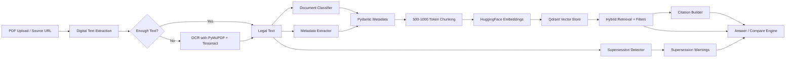
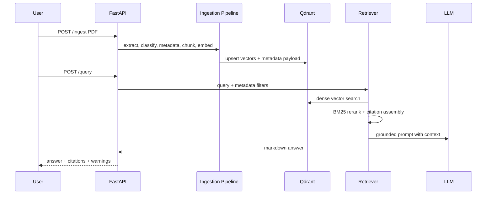

# Government Legal Documents RAG Pipeline

This repository is a production-quality interview submission for a Retrieval-Augmented Generation pipeline over government legal PDFs, including digitally-born PDFs, scanned PDFs with OCR, metadata-aware retrieval, supersession warnings, citations, and comparative answers.

## Architecture Plan

The system is split into independent stages so each production concern can evolve without destabilizing the others:

1. PDF ingestion accepts files and source URLs.
2. Text extraction first tries `pdfplumber` for digitally-born PDFs, then falls back to Tesseract OCR through PyMuPDF-rendered page images.
3. Legal classification and metadata extraction run before chunking so every chunk carries complete legal metadata.
4. Chunks are generated at 500-1000 token scale with overlap to preserve legal context.
5. HuggingFace `sentence-transformers/all-MiniLM-L6-v2` embeddings are stored in Qdrant with typed metadata payloads.
6. Retrieval combines dense search, metadata filtering, and BM25 reranking.
7. Answer generation uses an OpenAI-compatible LLM when configured, with a deterministic extractive fallback for local demos.
8. Citations, circular/notification numbers, dates, and supersession warnings are attached to every response.



## Data Flow



## Metadata Schema

The core metadata object is `LegalMetadata` in `src/legal_rag/schemas.py`.

| Field | Why it exists |
|---|---|
| `document_id` | Stable deduplication and source tracking |
| `title` | Human-readable citation and retrieval display |
| `circular_number` / `notification_number` | Legal identifiers required in final answers |
| `issuing_authority` | Metadata filtering and authority-specific queries |
| `publication_date` / `effective_date` | Date-range filters and legal effect reasoning |
| `subject` / `department` | Search narrowing and analytics |
| `document_type` | Classification into Circular, Notification, Gazette, Office Memorandum, Amendment, Order, Guideline |
| `superseded_document_references` | Downstream supersession warning support |
| `source_url` | Auditability and source reference |
| `version` | Version-aware legal document handling |

Qdrant payload indexes are created for `document_type`, `department`, `issuing_authority`, `document_id`, and `publication_date`.

## Retrieval Strategy

Hybrid retrieval is used because legal search needs both semantic recall and exact legal identifiers.

- Dense retrieval finds semantically relevant chunks even when wording differs.
- Metadata filtering restricts the search by document type, department, date range, issuing authority, or source document.
- BM25 reranking improves exact-match behavior for circular numbers, notification numbers, statutory phrases, and named schemes.
- Top-k defaults to `12`, inside the required `10-20` range, and reranking keeps the strongest `8`.

Tradeoff: dense retrieval is better for natural language questions, while BM25 is stronger for exact legal terms. Combining them reduces missed results without forcing users to know exact document wording.

## Supersession Strategy

Supersession detection uses high-precision legal phrase patterns:

- `supersedes`
- `in supersession of`
- `in partial modification of`
- `amendment to`
- `shall replace`

Detected relationships are stored as `SupersessionRelation` records with relation type, target reference, evidence text, and confidence. During retrieval, if an old document appears in the answer context and a newer relation targets it, the API returns:

`⚠ Supersession Warning: Circular No. XX has been superseded by Circular No. YY dated DD/MM/YYYY.`

In a full deployment, these relations would also be written to a graph table or Qdrant payload collection for cross-document traversal.

## Summary of Work

Built a modular Python 3.11 RAG backend for government legal documents. It supports PDF ingestion, OCR fallback, rule-based document classification, legal metadata extraction, chunking, HuggingFace embeddings, Qdrant vector storage, hybrid retrieval, citations, supersession warnings, comparative answers, FastAPI endpoints, Docker setup, tests, and interview-ready architecture documentation.

## Architecture

The backend is intentionally modular:

- `api.py` exposes REST endpoints.
- `pipeline.py` orchestrates ingestion.
- `pdf_loader.py` and `ocr.py` handle digital and scanned PDFs.
- `document_classifier.py` classifies legal document types.
- `metadata_extractor.py` extracts legal identifiers and dates.
- `chunker.py` creates retrieval-sized chunks.
- `embeddings.py` wraps HuggingFace sentence-transformers.
- `vector_store.py` owns Qdrant schema and storage.
- `retriever.py` runs dense retrieval, filtering, and reranking.
- `comparison.py` creates document-to-document comparisons.
- `citations.py` standardizes exact source references.
- `supersession.py` detects and surfaces replacement/amendment risk.

This separation makes it easier to replace a single component, for example upgrading the classifier to an ML model or replacing the LLM provider, without rewriting ingestion or retrieval.

## Implementation

### APIs

- `GET /health` returns service status.
- `POST /ingest` accepts a PDF upload plus optional `source_url`.
- `POST /query` answers a question with optional metadata filters.
- `POST /compare` compares two ingested documents by document ID.

### Classification

Classification is rule-based by default because government legal documents usually contain strong lexical signals such as "Circular No.", "Notification", "Gazette", "Office Memorandum", and "Amendment". This is explainable and reliable for an interview/demo setting. A future ML classifier can be added after labeled examples exist.

### Metadata Extraction

Regex extractors identify title, circular number, notification number, issuing authority, publication date, effective date, subject, department, source URL, version, and superseded references. Pydantic models enforce schema quality.

### OCR

The pipeline first uses text extraction. If the PDF has too little extractable text, each page is rendered with PyMuPDF and processed through Tesseract. This avoids unnecessary OCR cost for digital PDFs.

### Prompting

Prompts require grounded answers, exact citations, identifiers, dates, and source references. If an LLM is not configured, the system returns extractive evidence instead of hallucinating.

## Approach

The design favors correctness, traceability, and replaceable components.

- Pydantic models are used because legal metadata must be typed and auditable.
- Qdrant is used because it supports vector search plus metadata payload filtering.
- Sentence-transformers are used because they can run locally and are easy to deploy.
- Chunk sizes are constrained to 500-1000 tokens to preserve legal context while keeping retrieval precise.
- Supersession is separated from answer generation because it is a legal risk control, not a stylistic response feature.
- Comparison is implemented as a dedicated engine because comparative questions require grouping by source and producing structured differences.

Assumptions:

- Source PDFs are English or mostly English.
- Tesseract is installed in the runtime container.
- Circular and notification identifiers follow common government formatting.
- Production deployments will persist supersession relations in a relational or graph store in addition to vector payloads.

Edge cases handled:

- Scanned PDFs with no embedded text.
- Missing dates or document numbers.
- Unknown document type.
- Queries constrained by metadata filters.
- No LLM key configured.
- Old documents retrieved after newer supersession evidence is known.

## Evaluation

Recommended metrics:

- Ingestion success rate by PDF type.
- OCR character error rate on scanned samples.
- Metadata field precision and recall.
- Document classification accuracy.
- Retrieval recall@10 and MRR.
- Citation correctness rate.
- Supersession detection precision and recall.
- Answer groundedness and hallucination rate.
- Comparison table completeness.
- Latency for ingestion, retrieval, and answer generation.

Tests included:

- Document classifier tests.
- Supersession pattern tests.
- Chunker integrity tests.

Run:

```bash
pytest
```

## Scalability

Production scaling considerations:

- Run ingestion asynchronously with a queue for large PDF batches.
- Store raw PDFs in object storage and keep text/chunk manifests in a database.
- Use Qdrant replicas and shards for large collections.
- Cache embeddings for duplicate chunks.
- Batch embedding calls.
- Add monitoring for OCR latency and failed extractions.
- Store supersession relations in a graph model for fast lineage queries.
- Add tenant-aware authorization if documents span departments or clients.

## Security

- Validate upload type and size before ingestion.
- Scan uploaded PDFs for malware in production.
- Use least-privilege service credentials.
- Keep LLM API keys in environment variables or a secret manager.
- Log request IDs and metadata, not full sensitive document text.
- Add authentication and authorization around ingest/query endpoints.
- Preserve source URLs and citations for auditability.

## Future Improvements

- Add a trained legal document classifier.
- Add layout-aware chunking using headings, sections, tables, and annexures.
- Add cross-encoder reranking for higher precision.
- Persist supersession relationships in PostgreSQL or Neo4j.
- Add multilingual OCR and translation.
- Add human review workflows for extracted metadata.
- Add evaluation datasets and CI quality gates.
- Add UI for uploading, querying, comparing, and tracing citations.

## GitHub Repository Structure

```text
rag-legal-pipeline/
  Dockerfile
  docker-compose.yml
  requirements.txt
  pyproject.toml
  .env.example
  README.md
  src/
    legal_rag/
      __init__.py
      api.py
      chunker.py
      citations.py
      comparison.py
      config.py
      document_classifier.py
      embeddings.py
      llm.py
      logging_config.py
      metadata_extractor.py
      ocr.py
      pdf_loader.py
      pipeline.py
      prompts.py
      retriever.py
      schemas.py
      supersession.py
      vector_store.py
  tests/
    test_chunker.py
    test_classifier.py
    test_supersession.py
```

## Run Instructions

1. Copy environment settings:

```bash
cp .env.example .env
```

2. Start Qdrant and the API:

```bash
docker compose up --build
```

3. Open the API docs:

```text
http://localhost:8000/docs
```

4. Ingest a PDF:

```bash
curl -X POST "http://localhost:8000/ingest" \
  -F "file=@/path/to/government-document.pdf" \
  -F "source_url=https://example.gov/document.pdf"
```

5. Query the collection:

```bash
curl -X POST "http://localhost:8000/query?question=What changed in the latest circular?"
```

6. Compare two documents:

```bash
curl -X POST "http://localhost:8000/compare?document_a=<doc-id-a>&document_b=<doc-id-b>&question=Compare eligibility changes"
```

7. Run tests locally:

```bash
pip install -r requirements.txt
pytest
```
